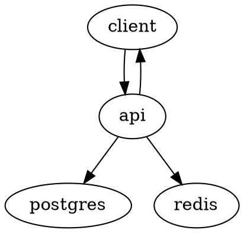
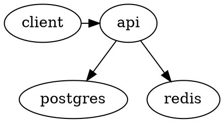
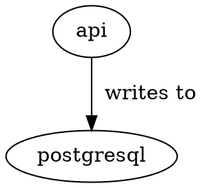
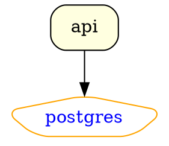
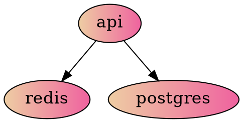
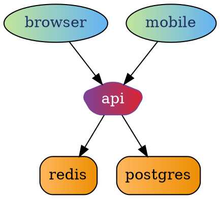

[back to home](./index.html)

## Dot language snippets

At times when I need to visually show how the components of a system work I reach out and use a very handy tool called [dot language](https://graphviz.org/doc/info/lang.html).

There are [many](https://dreampuf.github.io/GraphvizOnline/#digraph%20%7B%0A%20%20%20%20%20%20%20%20browser%2C%20mobile%20%5B%0A%20%20%20%20%20%20%20%20%20%20%20%20style%3D%22filled%22%2C%0A%20%20%20%20%20%20%20%20%20%20%20%20fillcolor%3D%22%23c2e59c%3A%2364b3f4%22%2C%0A%20%20%20%20%20%20%20%20%20%20%20%20fontcolor%3D%22%23203060%22%2C%0A%20%20%20%20%20%20%20%20%5D%3B%0A%20%20%20%20%20%20%20%20redis%2C%20postgres%2C%20api%20%5B%0A%20%20%20%20%20%20%20%20%20%20%20%20style%3D%22filled%2C%20rounded%22%2C%0A%20%20%20%20%20%20%20%20%5D%3B%0A%20%20%20%20%20%20%20%20redis%2C%20postgres%20%5B%0A%20%20%20%20%20%20%20%20%20%20%20%20shape%3D%22rectange%22%2C%0A%20%20%20%20%20%20%20%20%20%20%20%20fillcolor%3D%22%23FFB75E%3A%23ED8F03%22%2C%0A%20%20%20%20%20%20%20%20%5D%3B%0A%20%20%20%20%20%20%20%20api%20%5B%0A%20%20%20%20%20%20%20%20%20%20%20%20color%3D%22%237b4397%3A%23dc2430%22%0A%20%20%20%20%20%20%20%20%20%20%20%20fontcolor%3Dwhite%2C%0A%20%20%20%20%20%20%20%20%20%20%20%20shape%3D%22pentagon%22%0A%20%20%20%20%20%20%20%20%5D%3B%0A%20%20%20%20%20%20%20%20browser%20-%3E%20api%3B%0A%20%20%20%20%20%20%20%20api%20-%3E%20redis%3B%0A%20%20%20%20%20%20%20%20api%20-%3E%20postgres%3B%0A%20%20%20%20%20%20%20%20mobile%20-%3E%20api%3B%0A%7D), [many](https://shd101wyy.github.io/markdown-preview-enhanced/#/) tools to convert from dot language to svg or other image formats. The basics are simple, yet It's hard to have a consistent style and flow across multiple digrams.

Here I try to go over the basics and show a few snippets that I found usefull over time.  

Use arrow (`->`) to connect a node to another.

```js
digraph foo {
    client -> api;
    api -> postgres;
    api -> redis;
    api -> client;
}
```



Use rank to force some nodes be on the same line.

```js
digraph foo {
    { rank = same; client api }
    client -> api;
    api -> postgres;
    api -> redis;
}
```



Use `label` to rename a node, or comment on an arrow.

```js
digraph foo {
    pg [ label = "postgresql"];
    api -> pg [ label="  writes to" ];
}
```



Style your nodes using `style`, `fillcolor`, `color`, `fontcolor`, `shape`, and `fontsize`.

```js
digraph foo {
    api [
        shape="box",
        style="filled, rounded",
        fillcolor=lightyellow
    ];
    postgres [
        shape="pentagon",
        style="rounded",
        color="orange",
        fontcolor="blue"
    ];
    api -> postgres;
}
```



It's possible to style all nodes at the same time.

```js
digraph {
        node [
            style="filled",
            fillcolor="#EECDA3:#EF629F",
            fontsize=16
        ];
        api -> redis;
        api -> postgres;
}
```



You can also apply the same style on multiple nodes.

```js
digraph {
        browser, mobile [
            style="filled",
            fillcolor="#c2e59c:#64b3f4",
            fontcolor="#203060",
        ];
        redis, postgres, api [
            style="filled, rounded",
        ];
        redis, postgres [
            shape="rectange",
            fillcolor="#FFB75E:#ED8F03",
        ];
        api [
            color="#7b4397:#dc2430"
            fontcolor=white,
            shape="pentagon"
        ];
        browser -> api;
        api -> redis;
        api -> postgres;
        mobile -> api;
}
```



[back to home](./index.html)
